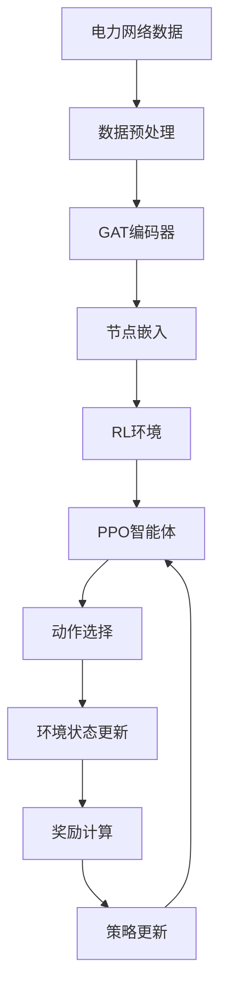
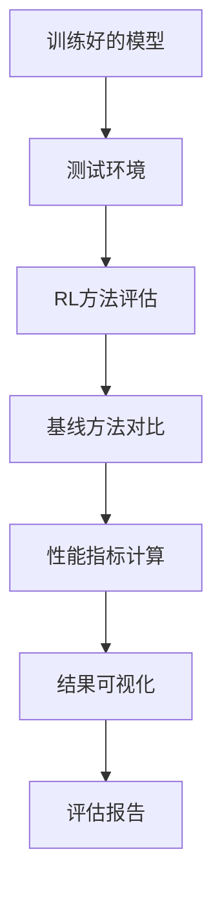

# 系统架构文档

本文档描述了电力网络分区强化学习系统的整体架构设计和核心组件。

## 🏗️ 系统概览

### 设计理念

系统采用**模块化设计**，将复杂的电力网络分区问题分解为独立的功能模块：

- **数据处理层**: 负责电力网络数据的加载、预处理和特征提取
- **模型层**: 包含GAT编码器和强化学习智能体
- **环境层**: 实现MDP环境和奖励系统
- **训练层**: 提供统一的训练接口和配置管理
- **评估层**: 包含基线方法对比和性能分析

### 核心特性

- **🧠 智能分区**: 基于GAT的图神经网络编码器
- **🎯 理论奖励**: 基于势函数理论的奖励系统
- **🛡️ 数值稳定**: 全面的NaN/inf保护和异常处理
- **🎭 场景生成**: 自动生成多样化训练场景
- **📊 基线对比**: 完整的基线方法对比框架
- **📈 性能分析**: 可扩展性、鲁棒性和收敛性分析

## 📁 项目结构

```
├── train.py                  # 训练模块（专注模型训练功能）
├── test.py                   # 评估模块（专注模型评估分析）
├── config.yaml              # 统一配置文件（包含奖励系统配置）
├── code/                     # 核心代码
│   ├── src/                  # 源代码
│   │   ├── data_processing.py    # 数据处理
│   │   ├── gat.py                # GAT编码器
│   │   └── rl/                   # 强化学习模块
│   │       ├── environment.py    # 环境定义
│   │       ├── agent.py          # PPO智能体
│   │       └── reward.py         # 奖励系统
│   └── baseline/             # 基线方法
├── docs/                     # 文档目录
│   ├── REWARD.md             # 奖励系统详细说明
│   ├── BASELINE_METHODS.md   # 基线方法说明
│   ├── REINFORCEMENT_LEARNING.md # 强化学习模块说明
│   └── SYSTEM_ARCHITECTURE.md    # 系统架构说明（本文档）
├── cache/                    # 数据缓存
├── logs/                     # 训练日志
├── checkpoints/              # 模型检查点
├── figures/                  # 可视化图表
└── test_results/             # 测试结果
```

## 🔧 核心组件

### 1. 数据处理层 (`data_processing.py`)

**功能**: 电力网络数据的加载、预处理和特征提取

**主要组件**:
- `HeteroDataProcessor`: 异构图数据处理器
- `PowerGridDataLoader`: 电力网络数据加载器
- `FeatureExtractor`: 特征提取器

**关键特性**:
- 支持多种电力网络格式（IEEE标准、MATPOWER等）
- 自动特征归一化和缺失值处理
- 异构图构建和节点/边特征提取
- 数据缓存机制提高加载效率

### 2. 图神经网络层 (`gat.py`)

**功能**: 基于图注意力网络的节点嵌入生成

**主要组件**:
- `HeteroGAT`: 异构图注意力网络
- `AttentionLayer`: 注意力层实现
- `NodeEmbedding`: 节点嵌入生成器

**关键特性**:
- 融入电气阻抗的物理引导注意力机制
- 支持异构图的多类型节点和边
- 可配置的网络深度和注意力头数
- 高效的批处理和GPU加速

### 3. 强化学习层 (`rl/`)

**功能**: 实现完整的强化学习训练和推理系统

**主要组件**:
- `PowerGridPartitioningEnv`: MDP环境实现
- `PPOAgent`: PPO智能体实现
- `DualLayerRewardFunction`: 双层奖励系统
- `ActionSpace`: 两阶段动作空间
- `StateManager`: 状态管理器

**关键特性**:
- 基于势函数理论的奖励塑造
- 两阶段动作选择机制
- 动作掩码确保物理约束
- 支持并行训练和课程学习

### 4. 基线方法层 (`baseline/`)

**功能**: 提供多种传统分区方法用于对比分析

**主要组件**:
- `SpectralPartitioner`: 谱聚类分区器
- `KMeansPartitioner`: K-means分区器
- `PartitionEvaluator`: 分区质量评估器
- `MethodComparator`: 方法对比器

**关键特性**:
- 统一的分区器接口
- 多种评估指标支持
- 自动化对比分析
- 结果可视化和报告生成

## 🔄 数据流

### 训练阶段数据流



### 评估阶段数据流



## ⚙️ 配置系统

### 配置文件结构

```yaml
# 数据配置
data:
  case_name: "ieee14"
  cache_enabled: true
  
# GAT编码器配置
gat:
  hidden_dim: 64
  num_heads: 4
  num_layers: 3
  
# 强化学习配置
rl:
  algorithm: "ppo"
  learning_rate: 3e-4
  batch_size: 64
  
# 奖励系统配置
environment:
  reward_weights:
    reward_mode: "dual_layer"
    balance_weight: 1.0
    decoupling_weight: 1.0
    power_weight: 1.0
    
# 训练配置
training:
  episodes: 1500
  parallel_training: false
  scenario_generation: true
```

### 配置管理特性

- **层次化配置**: 支持多层级配置继承
- **环境变量**: 支持通过环境变量覆盖配置
- **配置验证**: 自动验证配置参数的有效性
- **动态配置**: 支持训练过程中的配置调整

## 🚀 训练系统

### 训练模式

1. **Fast模式**: 快速训练，适合日常开发和测试
2. **Full模式**: 完整训练，获得最佳性能
3. **IEEE118模式**: 大规模网络训练

### 训练流程

1. **初始化**: 加载配置、创建环境和智能体
2. **预训练**: GAT编码器预训练（可选）
3. **强化学习训练**: PPO智能体训练
4. **检查点保存**: 定期保存模型和训练状态
5. **性能评估**: 训练过程中的性能监控

### 并行训练支持

- **多进程训练**: 支持多CPU核心并行训练
- **GPU加速**: 自动检测和使用GPU资源
- **分布式训练**: 支持多机分布式训练（实验性）

## 📊 评估系统

### 评估指标

1. **分区质量指标**:
   - 负载平衡度 (CV)
   - 电气解耦度
   - 连通性
   - 模块度

2. **性能指标**:
   - 训练收敛速度
   - 计算时间
   - 内存使用
   - 可扩展性

3. **鲁棒性指标**:
   - 不同随机种子的稳定性
   - 网络扰动的鲁棒性
   - 参数敏感性分析

### 对比分析

- **基线方法对比**: 与传统分区方法的性能对比
- **消融研究**: 不同组件的贡献分析
- **参数敏感性**: 关键参数的影响分析
- **可扩展性分析**: 不同网络规模的性能表现

## 🛡️ 质量保证

### 数值稳定性

- **NaN/inf检测**: 全面的数值异常检测和处理
- **梯度裁剪**: 防止梯度爆炸
- **数值范围限制**: 确保计算结果在合理范围内
- **异常恢复**: 自动异常恢复机制

### 错误处理

- **分层错误处理**: 不同层级的错误处理策略
- **优雅降级**: 部分功能失效时的降级处理
- **详细日志**: 完整的错误日志和调试信息
- **自动重试**: 临时错误的自动重试机制

### 测试覆盖

- **单元测试**: 核心组件的单元测试
- **集成测试**: 端到端的集成测试
- **性能测试**: 性能基准测试
- **回归测试**: 防止功能回退的回归测试

## 🔧 扩展性设计

### 模块化架构

- **插件式设计**: 支持新组件的插件式扩展
- **接口标准化**: 统一的组件接口规范
- **配置驱动**: 通过配置文件控制系统行为
- **热插拔支持**: 运行时组件替换（部分支持）

### 可扩展点

1. **新的奖励函数**: 通过继承基类添加新的奖励函数
2. **新的基线方法**: 通过标准接口添加新的分区方法
3. **新的网络架构**: 支持不同的图神经网络架构
4. **新的训练算法**: 支持不同的强化学习算法

## 📈 性能优化

### 计算优化

- **向量化计算**: 使用PyTorch的向量化操作
- **内存池**: 减少内存分配和释放开销
- **计算图优化**: PyTorch计算图的优化
- **批处理**: 高效的批处理机制

### 存储优化

- **数据缓存**: 智能的数据缓存策略
- **压缩存储**: 模型和数据的压缩存储
- **增量保存**: 增量式检查点保存
- **清理机制**: 自动清理过期数据

## 🔮 未来发展

### 计划功能

1. **多目标优化**: 支持多目标分区优化
2. **在线学习**: 支持在线学习和适应
3. **联邦学习**: 支持分布式联邦学习
4. **可解释性**: 增强模型的可解释性

### 技术演进

1. **新的图神经网络**: 集成最新的GNN架构
2. **高级强化学习**: 支持更先进的RL算法
3. **自动化调优**: 自动超参数优化
4. **云原生部署**: 支持云原生部署和扩展
